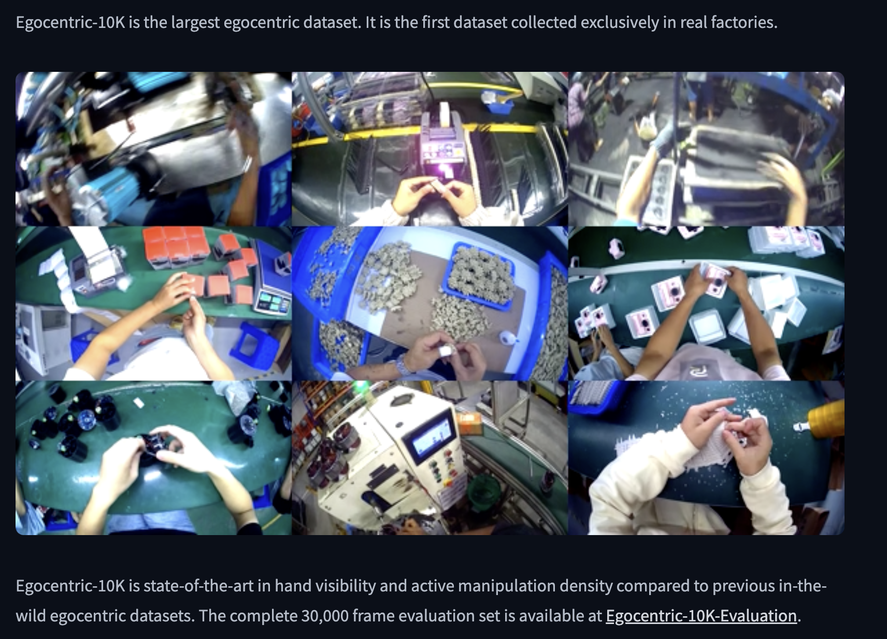
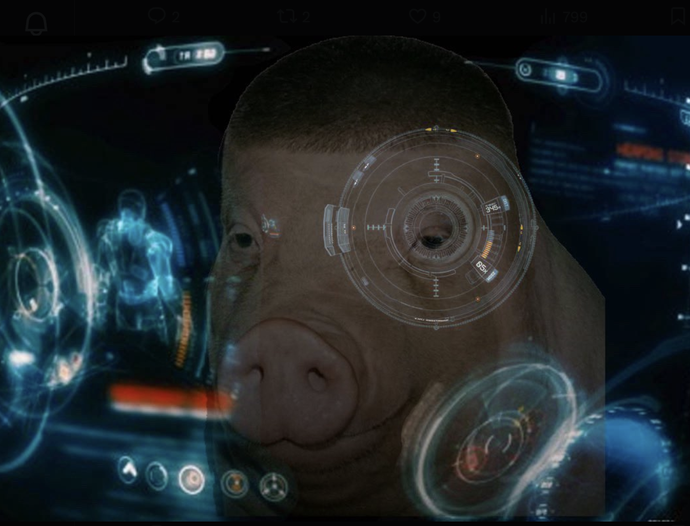

# Factory Vision - Egocentric-10K Mini Explorer

A lightweight Python app that streams random factory worker clips from the [Egocentric-10K dataset](https://huggingface.co/datasets/builddotai/Egocentric-10K), extracts frames, and uses GPT-4o-mini vision API to analyze worker actions, tools, and safety gear.



## Features

- **Streaming-only** - No local video storage required
- **Cost-effective** - Under $5 total with GPT-4o-mini
- **Safety controls** - Rate limiting, token limits, JPEG compression
- **Dual interface** - CLI batch processing + Streamlit web app
- **Real-time analysis** - Worker actions, tools, objects, safety gear detection

## Dataset

This project uses the [Egocentric-10K dataset](https://huggingface.co/datasets/builddotai/Egocentric-10K) - a collection of first-person factory worker videos.

## Setup

1. **Clone the repository**
   ```bash
   git clone git@github.com:carsonmulligan/factory-vision.git
   cd factory-vision
   ```

2. **Create virtual environment and install dependencies**
   ```bash
   python3 -m venv venv
   source venv/bin/activate
   pip install -r requirements.txt
   ```

3. **Configure API keys**

   Edit `.env` file with your credentials:
   ```
   OPENAI_API_KEY=your_openai_key_here
   HF_TOKEN=your_hf_token_here
   ```

   - Get OpenAI API key: https://platform.openai.com/api-keys
   - Get HuggingFace token: https://hf.co/settings/tokens
   - Accept dataset terms: https://huggingface.co/datasets/builddotai/Egocentric-10K

4. **Download sample clips (for web app)**
   ```bash
   python preload_clips_fast.py
   ```
   Downloads 10 clips locally (~30 seconds). Enables instant app loading.

## Usage

### Batch Analysis Pipeline

Process 50 random clips and save results to JSON:

```bash
python main.py
```

Output: `egocentric_analysis.json` with cost report

### Interactive Web App

Launch the Streamlit interface:

```bash
streamlit run app.py
```

Click "Load Random Worker Clip" to stream and analyze frames in real-time.

## Configuration

Edit `src/config.py` to adjust:

- `MAX_CLIPS` - Number of clips to process (default: 50)
- `FRAMES_PER_CLIP` - Frames extracted per clip (default: 3)
- `FRAME_INTERVAL_SEC` - Seconds between frames (default: 10)
- `MAX_TOKENS` - GPT-4o-mini response limit (default: 150)

## Cost Breakdown

- **Model**: GPT-4o-mini
- **Pricing**: $0.15/1M input tokens, $0.60/1M output tokens
- **Per frame**: ~$0.0002-0.0005
- **Total (50 clips × 3 frames)**: <$2.50

## Safety Features

- Streaming-only (no local video storage)
- JPEG compression at 85% quality
- 0.1s rate limit between API calls
- No audio processing or PII storage
- Results saved as JSON text only

## Project Structure

```
factory-vision/
├── src/                    # Core library modules
│   ├── config.py          # Configuration and cost tracking
│   ├── stream_sampler.py  # Dataset streaming and frame extraction
│   └── vision_analyzer.py # GPT-4o-mini vision API integration
├── app.py                 # Streamlit web interface
├── main.py                # Batch processing pipeline
├── preload_clips.py       # Setup script (streaming method)
├── preload_clips_fast.py  # Setup script (API method, faster)
├── requirements.txt       # Dependencies
└── .env                   # API credentials (not committed)
```

## Next Steps

- Fine-tune a CLIP model using labeled frames
- Build a safety gear detection model
- Deploy Streamlit app publicly
- Expand to multi-factory analysis

## License

MIT

## Author

[@us_east_3](https://twitter.com/us_east_3)

---


